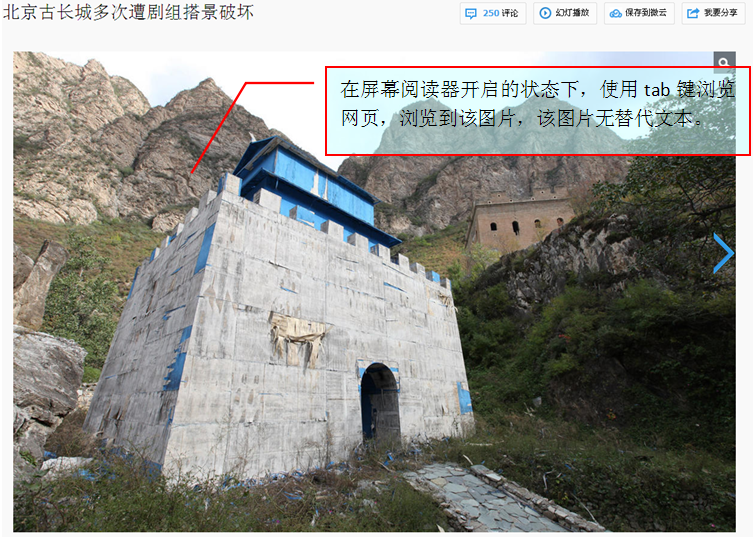
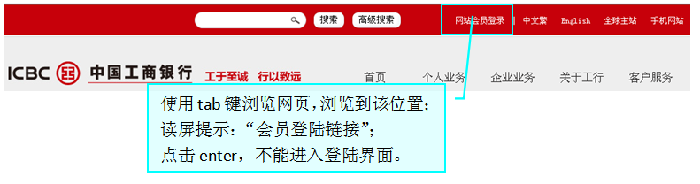
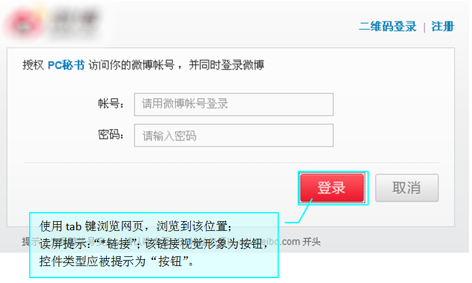

## 用户问题

### 1. 非装饰性图片无替代文本
#### 描述
  对于非装饰性图片，例如商品图片，新闻背景，应该添加正确的替代文本，用以说明图片所展示的内容，
  否则用户将无法了解到图片所要传递的信息。
#### 现状
  
  
### 2. 图片链接缺少目的文本
#### 描述
  带链接的图片需要目的文本来说明链接的目的导向。用户通过屏幕阅读器获取链接的目的文本，从而了解链接作用。
#### 现状
  
  
### 3. 图片按钮缺少目的文本
#### 描述
  由于按钮使用图片或某些特殊性标识符展现，屏幕阅读器无法读出按钮所展现内容，用户难以理解按钮本身所表达的意思，从而无法做出正确的操作。
#### 现状
  
  
### 4. 图片按钮/链接不能响应回车键
#### 描述
  对于HTML标准控件anchors和buttons来说，默认是支持鼠标点击，和按enter键来触发`onClick`事件的，出现问题的多半是用其它元素模拟的链接或者按钮。
#### 现状
  
  
### 5. 图片按钮控件类型朗读不正确
#### 描述
  接上个问题，自定义图片按钮，屏幕阅读器无法提示为“按钮”控件，使用屏幕阅读器用户无法对按钮做出正确的操作。
#### 现状
  
  
### 6. 图片按钮无法获得键盘焦点
#### 描述
  使用屏幕阅读器浏览网页，无法聚焦到按钮上，导致无法操作，开发者为了让按钮更加美观，也可能故意使用各类方式让按钮无法聚焦
#### 现状
  
  

