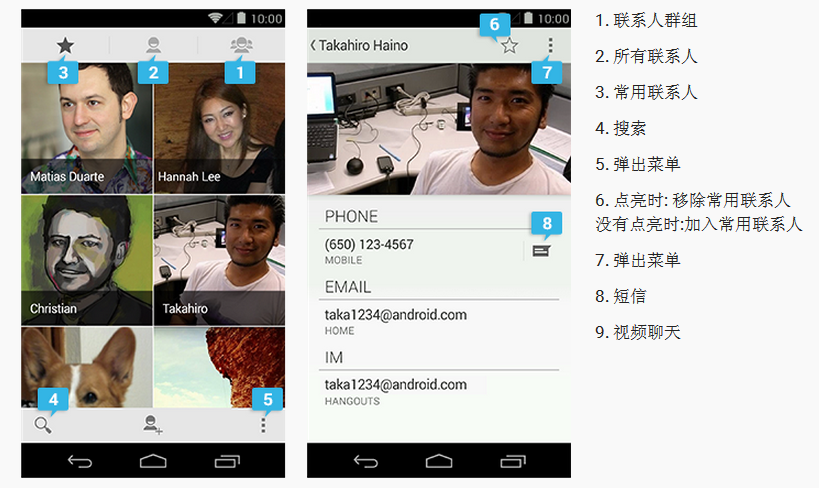

# （二）android无障碍设计指南


参考来源：https://developer.android.com/guide/topics/ui/accessibility/index.html

## 1.Android无障碍设计指导原则


    Android 设计原则中“让哥知道现在在哪儿”是无障碍性的关键。当用户在应用中浏览时，他们需要通过一定的反馈来知道自己的位置。设计一个合理的应用结构是关键。大多数用户可以通过视觉和振动反馈了解浏览的位置 (例如文字标签、颜色、图标和触摸反馈)，视觉障碍的用户则需要通过语音提示和高对比视觉效果来了解位置。
    设计应用时，请记住有时文字标签是需要通过语音进行提示的。当使用 Explore by Touch 时，用户可以通过声音来了解你的应用结构，它们应当是简洁、清楚且明了的。请按照下面的指导进行设计，以满足各种用户的需求。
    1）使导航符合直觉
    设计一个清晰且明确的工作流程，减少导航步骤，尤其是对于重要的任务。保证各种任务都能通过控件进行操作。
    2)使用推荐的触摸控件大小
    48 dp 是推荐的触摸控件大小。控件之间留白为8dp；阅读度量单位和网格一节，了解如何帮助你的用户使用。对于一些特别的用户，可能需要使用更大一些的控件。例如对于教育应用，更大的控件会比较适合儿童或者有行动障碍的人士使用。
    3）视觉元素的文字标签要有意义
    在你做设计时，label functional UI 控件可能没有文字标签，例如按钮、图标、图标标签和状态图标。开发者可以通过阅读 contentDescription 了解如何设置这些控件的文字标签属性。
    这个属性的主要功能是为视力有障碍的人增加对控件的解释。这个属性必须在用户的Accessible中的相应属性开启后才能使用。设置View的备注说明，作为一种辅助功能提供,为一些没有文字描述的View提供说明，如ImageButton。这里在界面上不会有效果，自己在程序中控制，可临时放一点字符串数据。
    设置View的备注说明，作为一种辅助功能提供,为一些没有文字描述的View提供说明，如ImageButton。这里在界面上不会有效果，自己在程序中控制，可临时放一点字符串数据。
    （1）首先下载google的应用 TalkBack (an accessibility service published by Google) 并且将功能打开 Settings > Accessibility > TalkBack 设置为On。
    （2）在应用中添加这个属性。
    ```<Button
    android:id=”@+id/pause_button”
    android:src=”@drawable/pause”
    android:contentDescription=”@string/pause”/>```
    （3）由于这个控件没有text属性，对于一些用户来说，无法理解这个控件是做什么的。这时用户点击这个控件。android系统会自动使用人声朗读控件上android:contentDescription属性说指向的内容。这样用户就可以知道这个控件是做什么用的。Android布局contentDescription属性：
```
1.<RelativeLayout xmlns:android="http://schemas.android.com/apk/res/android"  
2.    xmlns:tools="http://schemas.android.com/tools"  
3.    android:layout_width="match_parent"  
4.    android:layout_height="match_parent"  
5.    android:paddingBottom="@dimen/activity_vertical_margin"  
6.    android:paddingLeft="@dimen/activity_horizontal_margin"  
7.    android:paddingRight="@dimen/activity_horizontal_margin"  
8.    android:paddingTop="@dimen/activity_vertical_margin"  
9.    tools:context=".MainActivity" >  
10.    <TextView  
11.        android:id="@+id/span_text"  
12.        android:layout_width="wrap_content"  
13.        android:layout_height="wrap_content"  
14.        android:layout_centerInParent="true"  
15.        android:contentDescription="这是一个文本"  
16.        android:text="@string/hello_world" />  
17.</RelativeLayout>```

    图1 android 系统contentDescription属性展示
    4）为即时消失的控件提供替代启示
    App可能有图标和控件会在一段事件之后消失。例如，打开视频后5秒钟，播放按钮会在屏幕上消失。根据talkback的工作方式，这些控件只有当聚焦的时候才会被朗读出来。如果他们很快的消失，用户可能根本就不知道这些控件的存在。因此，保证重要功能不能依靠即时消失控件。如果控件连接着重要功能，保证用户可以打开控件，且功能在其他处可获得。
    当无障碍设备打开时，也可以改变app的行为。开发者能够保证即时消失的控件不会消失。
    5）使用标准的开发框架控件或者让自定义控件支持 TalkBack
    标准的 Android开发框架控件自动支持无障碍性服务，并且已经包含了 ContentDescriptions 属性。一个被经常忽视的系统控件是字体大小，用户可以在设置中打开一个全系统大字体。在app中使用系统默认的字体将会让用户更加喜欢app；为了在app中使用系统字体大小，标记文本和它的容器使用像素来衡量。
    另外，记住当用户使用大字体或者不同语言，它们使用的容器比分配的空间大。阅读设备和显示器支持多屏显示的设计策略。
    如果使用自定义控件，安卓有开发工具来让自定义控件符合以上的原则，提供界面有效的描述。自定义控件的边界足够突出，知道开发者来自定义视图文档。

## 2.android无障碍要求


    完成以下步骤，可以保证最低限度的应用无障碍；
    1）描述用户界面控件：
    为没有视觉文本的用户界面元素提供内容描述：尤其是图片按钮（ImageButton）、图片视图（ImageView）、复选框（CheckBox）；使用android:contentDescription XML布局属性，或者setContentDescription(CharSequence) 方法来提供内容描述信息。（装饰性图片除外）
    2）启用基于焦点的导航：
    确保用户可以使用基于硬件或者软件指向的控件来导航当前屏幕布局，导航方式有D-垫、轨迹球、键盘和导航手势；在某些情况下，需要让用户界面元素可聚焦，或者改变焦点顺序来使用户操作更符合逻辑。
    3）自定义视图控件：
    如果在app中使用自定义界面控件，需要使用支持库（support Library）来添加最新的无障碍特性；
    4）除音频外，添加多种反馈：
    在音频反馈之外，需要为聋和重听用户提供第二种反馈。例如，信息到来的声音警报必须伴随系统通知，触觉反馈或者其他视觉警告。
    5）测试：
    使用定向控件和talkback非视觉导航app来测试无障碍性。欲了解更多辅助功能测试的信息，请参阅辅助功能测试清单（ Accessibility Testing Checklist）。

## 3.android无障碍建议


    以下建议步骤保证app的无障碍性。如果不采用这些步骤，可能会影响整体的无障碍和质量；
    1）android设计无障碍指南：在布局之前，遵循无障碍指南（详见1.Android无障碍设计指导原则）。
    2）使用框架提供控件：尽可能采用android内置的用户界面控件，因为这些元素默认提供无障碍支持；
    3）即时（temporary）控件、自隐藏控件、通知：避免使用具有淡出或一定事件之后消失的用户控件。如果这个行为很重要，提供这些功能的备用接口。

## 4.特殊情况和建议


    以下列表描述了需要使用action来保证app无障碍性的特殊情况。查看以下列表，选择合适的特殊案例和建议。
    1）文本域提示（text field hints）：
    对于文本编辑区域，当文本域为空或当完成输入时内容可以读出，使用android:hint 属性来帮助用户理解期待输入的内容，而不是content description；
    2）带有视觉效果的自定义控件：
    如果您的应用中包含带有视觉效果的自定义控件（如日历控件），默认的无障碍服务是无法为用户提供良好的体验的，您应该考虑使用AccessibilityNodeProvider为控件提供虚拟的层级视图。
    3）自定义控件和点击事件处理：
    如果自定义控件提供对用户触摸交互的处理，例如onTouchEvent（MotionEvent）对MotionEvent.ACTION_DOWN和MotionEvent.ACTION_UP的监听，并将之视为一次点击事件，您必须触发一个等同于一次点击事件的AccessibilityEvent事件，并为这个点击行为提供辅助功能服务。
    4）会改变功能的控件：
    如果应用中有button或者其他在正常用户行为中能改变功能的控件（例如，button从play变成了pause），确保button的android:contentDescription也对应做了改变。
    5）为相关控件提供提示：
    当用户与一个提供单一功能的控件集（如DatePicker）内的某个控件交互时，需提供有效的音频反馈。
    6）视频播放与字幕：
    如果应用提供视频播放功能，必须支持字幕以帮助听力障碍的用户理解信息。视频播放控件也必须清楚地表明字幕是否可用，并提供一个明确的方法以启用字幕。
    7）添加无障碍特性的音频反馈：
    只使用Android的无障碍框架为应用提供无障碍特性的音频反馈，如TalkBack这样的辅助功能服务应该是为应用提供无障碍特性的音频提示的唯一服务。在XML Layout中，使用android：contentDescription属性来添加提示信息，这个属性也可以通过无障碍框架的API来动态的添加进去。
    例如，您的应用有自动翻页功能，您需要使用announceForAccessibility（CharSequence）方法来让talkback之类的辅助功能服务播放此信息的音频从而通知用户已翻页。
    8）复杂视觉交互的自定义控件：
    对于提供复杂视觉交互或者非标准视觉交互的自定义控件，使用可为辅助功能服务提供简单交互模型的AccessibilityNodeProvider来提供一个层级视图。如果这种方法不可行，则考虑提供一个不同的无障碍的视图。
    9）小控件：
    如果有比推荐最小触摸尺寸还小的控件在应用界面中，考虑使用ViewGroup把他们分组，并为之提供android：ntentDescription。
    10）装饰性的图像与图形：
    应用界面内只作为装饰且不提供内容或者不可供用户操作的元素，不应该有无障碍内容描述。

## 5.开发无障碍应用（ Developing Accessible Applications）


    Android有几个可访问性焦点特性融入了平台，这些特性使你能够非常容易地优化你的应用程序，使之适应于那些在视力或肢体不方便的用户群。 但是，什么才是正确的、最优的，或者最简单的方法去利用这个框架去实现这个目标呢？有时候还不是那么显而易见的。 本节展示怎样去实现这样的策略和有助于使安卓应用程序具有更加无障碍。

### 5.1添加内容描述


    一个精心设计的用户界面通常有一些元素，这些元素并不需要一个显式标签来向用户表明它们的用途。 在一个任务列表的应用中，一个复选框紧挨着一个选项(item)表现出一个很明显的用途——如同在文件管理应用中做一个垃圾桶。 但是，对于那些视弱的用户而言，还需要做一些其他UI提示。 
    幸运的是，你现在可以非常容易地在你的应用中的UI元素添加标签。 这些标签可以通过一个基于语音的辅助性服务比如TalkBack，向你的用户大声朗读。 如果你有一个标签，这个标签在整个应用程序的生命周期中都不会改变（例如"pause"或者"purchase"),你可以通过XML布局来设置。 只要通过设置UI元素的android:contentDescription这个属性，如下所示：  
```
<Button
    android:id="@+id/pause_button"
    android:src="@drawable/pause"
    android:contentDescription="@string/pause"/>```
    然而，在大多数情况下，需要在一些上下文中提供内容描述。 例如：一个开关按钮的状态，或者是像列表项类似的一些可选择数据。 为了在运行时编辑这些内容描述，可以使用setContentDescription()方法，作法如下：  
    ```
    String contentDescription = "Select " + strValues[position];
    label.setContentDescription(contentDescription);```
    这种添加方式对于应用程序而言是最简单的可接入性改善，却也是最有效的方式。 试着在任何需要有用信息的地方添加内容描述，但这样做的前提是该信息真的是需要的，不要为没有用的信息添加标签。 例如，为应用程序的图标设置相应的内容描述，那只会增加"噪音"，因为这些内容描述对用户来说是没用的，用户只想要从你的界面获得对他有用的信息。试一试！下载TalkBack(谷歌发行的一款辅助性服务）后，通过执行Settings > Accessibility > TalkBack来使能它。         接下来打开你自己的应用程序，听听TalkBack提供的语音提示吧！ 

### 5.2设计焦点引导


    应用本该提供更多的引导方法而不仅仅只有触摸屏幕这一种方法。很多android设备都有引导硬件而不是触摸屏，像十字键，方向键，轨迹球。另外，后面版本也支持外部设备，比如以USB或蓝牙为媒介的键盘。 为了使能这种引导方式，对用户来说所有的引导元素如要需要设置焦点，可以通过使用相应UI控件的View.setFocusable()这个方法来设置,或者通过在XML布局文件中android:focusable这个属性。 并且，每一个UI控件有4个属性， android:nextFocusUp, android:nextFocusDown, android:nextFocusLeft 和 android:nextFocusRight。你可以使用这些属性来设计下一个视图从对应的方向接收焦点。尽管平台自动决定引导的顺序是基于布局邻近，如果它不适合于你的应用，你可以使用这些属性去重写那些顺序。 举个例子，下面是如何表示一个按钮和一个标签，两个都设置了focusable属性。当你按下按钮后会转到这个文本视图，松开后又回到这个按钮。  
```
<Button android:id="@+id/doSomething"
    android:focusable="true"
    android:nextFocusDown="@id/label"
    ... />
<TextView android:id="@+id/label"
    android:focusable="true"
    android:text="@string/labelText"
    android:nextFocusUp="@id/doSomething"
    ... />```
    直观地验证应用在这些情形所产生效果。最简单的方法是直接在安卓模拟器运行你的应用，使用模拟器上的方向键操作用户界面，用OK键代替触摸动作来选择UI控件。 

### 5.3触发辅助性事件


    如果使用安卓框架中的视图组件，在用户界面中选择一个item或改变焦点，一个AccessibilityEvent将被创建。这些事件会被辅助性服务检查，使它能够为用户提供如text-to-speech相似的特性。    如果写一个自定义的视图，确保它在适当的时候触发事件。通常事件通过 调用sendAccessibilityEvent(int)来生成，该方法的参数为一个表示事件触发的值。目前支持的较完整的事件类型列表可以在AccessibilityEvent这个类的参考文档中找到。举例说明：当想要拓展一个图像视图，当这个视图有焦点的时候，你能够通过键盘在这个视图上写入字幕。它可以去触发一个TYPE_VIEW_TEXT_CHANGED事件，虽然这样构建图像视图并不是很标准。生成这个事件的代码如下：  
```
public void onTextChanged(String before, String after) {
    ...
    if (AccessibilityManager.getInstance(mContext).isEnabled()) {
        sendAccessibilityEvent(AccessibilityEvent.TYPE_VIEW_TEXT_CHANGED);
    }
    ...
}```

### 5.4测试你的应用


当把无障碍功能加入到应用中，一定要测试这个无障碍功能。为了测试内容描述和无障碍事件，安装和使能一个辅助服务。一个选择是Talkback，它是安卓市场上一个免费的，开源屏幕阅读器。启动服务后，在应用程序上测试所有的引导走向，然后听下所产生语音反馈。并且，尝试使用方向控制器操作应用程序，而不仅仅是触摸屏幕。也可以使用其他有方向键或轨迹球的设备，如果它可以用的话。如果不能用的话，使用安卓模拟器和它的模拟键盘控制器。 在该服务提供的反馈和方向盘来操作应用时，应该有觉悟，应用程序可能被操作而没有任何视觉上的提示。修改出现的问题，然后就会得到无障碍性很强的一个安卓应用程序。 
6.使应用无障碍（Making Applications Accessible）
当视觉、物理和老龄化限制用户激活设备上的无障碍服务和特性，安卓应用将会更加无障碍。这些服务会让应用更加无障碍，而不需要改变任何代码。然而，下面有几个步骤应该用来优化应用的无障碍性并保证所有用户有一个好的用户体验。
保证应用对所有用户无障碍仅仅需要几步，特别是使用android框架元素来创建用户界面的时候。如果只使用标准元素，步骤是：
这些服务特别地当你使用基于框架的用户界面组件时，要确保所有用户比较容易地访问你的应用程序。如果你只是使用标准的组件来构建你的应用程序，那么以下有几个步骤能够确保你的程序具有可访问性：
1.使用android:contentDescription属性为应用界面控件添加描述文本。尤其是ImageButton, ImageView, EditText, CheckBox。
2.保证所有用户界面元素都可以接收到输入（触摸或按压），并可以通过定向控制到达，例如踪迹球, D-pad (物理或视觉)和 导航手势。 
3.保证所有的音频反馈与视觉都是一致，来帮助聋和重听用户。
4.只使用无障碍导航服务和特性来测试应用。打开Talk和Explore by Touch，然后使用定向定向控制测试应用。
如果使用扩展视图类自定义控件，必须完成一些额外的工作来保证元素无障碍。
注意：以下的步骤描述了让盲和低视力用户无障碍使用的需求。

6.1标志用户界面元素
很多用户界面元素依靠视觉提示来说明含义和用处。例如，一个信息采集app可能使用带有加号图片的ImageButton来说明用户可以添加信息。一个EditText组件可能有一个临近的label来说明目的。视障用户看不到这些提示，将使这些组件失效。
可以使用android:contentDescription XML layout属性来使这些控件更加无障碍。这个属性的文本不会出现在屏幕上，但是用户如果激活无障碍服务来提供语音提示，当用户导航到这个控件的时候，文本就会被读出来。
因为这个原因，以下ImageButton的设置为加号按钮添加内容描述到add_note string 资源，可以将描述内容定义为添加信息。
<ImageButton 
    android:id=”@+id/add_note_button” 
    android:src=”@drawable/add_note” 
    android:contentDescription=”@string/add_note”/>
通过包含描述，提供语音反馈的无障碍服务可以读出“添加信息”，当用户将焦点移到这个按钮，或者划过。
注意：对于EditText区域，提供 android:hint属性来帮助用户理解什么内容需要输入，而不是使用android:contentDescription。当编辑框有内容时，talkBack会读出输入内容，而不是hint 文本。
6.2启用焦点导航
焦点导航允许残障用户通过用户界面控制使用定向控制来导航app。定向控制可以是物理的，比如轨迹球，方向键（D-PAD）或箭头键，或者视觉，比如 Eyes-Free Keyboard，或者手势导航模式。定向控制对很多android用户来说是首选的导航方式。
保证用户可以使用定向控制来导航app，保证所有用户界面输入控件都可以到达并在不触摸的情况下激活。也需要确保点击定向控制的中心按钮和有焦点控件的触摸有同样的效果。定向控制的更多信息，请查阅焦点导航测试（Testing focus navigation）。
6.2.1启用视图焦点 
当 android:focusable设置为true时，使用定向控制时用户界面元素可到达。这个设置允许用户使用定向控制聚焦到元素上，并与之交互。用户界面控制默认是由android框架提供和通过改变控件的外形来指明焦点。
Android提供集中API来让开发者控制用户界面元素是不是可以聚焦，并请求控件给予焦点：
setFocusable()
isFocusable()
requestFocus()
如果一个视图默认不能被聚焦，可以在布局文件中将android:focusable 属性设置为true，或者调用setFocusable()方法。
6.2.2焦点控制命令
当用户使用定向控制在任何方向导航，焦点可以而能一个用户界面元素传到另一个，按照设定好的焦点顺序。这个顺序是基于给定方向临近元素的算法来确定的。在真实的案例中，这个算法不会符合使用习惯和用户的逻辑。这种情况下，可以使用以下布局文件的XML属性提供显示覆盖：
android:nextFocusDown
 当用户导航为向下时定义下一个视图接收焦点。 

android:nextFocusLeft
 当用户导航为向左时定义下一个视图接收焦点。

android:nextFocusRight
 当用户导航为向右时定义下一个视图接收焦点。 

android:nextFocusUp
 当用户导航为向上时定义下一个视图接收焦点。 

下面的示例XML布局展示了两个可定焦的用户界面元素,android:nextFocusDown和android:nextFocusUp属性被显式地设置。TextView位于右边的EditText。然而,通过这些属性设置,TextView元素现在可以做到当按向下箭头时当前焦点是EditText元素：
  
<LinearLayout android:orientation="horizontal"
        ... >
    <EditText android:id="@+id/edit"
        android:nextFocusDown=”@+id/text”
        ... />
    <TextView android:id="@+id/text"
        android:focusable=”true”
        android:text="Hello, I am a focusable TextView"
        android:nextFocusUp=”@id/edit”
        ... />
</LinearLayout>
当修改焦点顺序的时候和反向导航的时候，保证每一个界面控件所有方向都可以导航。
注：可以通过在运行时改变用户界面焦点顺序，使用setNextFocusDownId() 和setNextFocusRightId().
6.3创建可访问自定义视图
如果app需要自定义视图组件，必选做额外的工作来保证自定义视图的无障碍。这是保证视图无障碍最主要的问题：
处理定向控制器点击；
实现无障碍API方法；
发送AccessibilityEvent对象到指定的自定义视图；
在视图中填充AccessibilityEvent和 AccessibilityNodeInfo。
6.3.1处理定向控制器的点击
在大多数的设备上，使用定向控制器点击视图发送具有KEYCODE_DPAD_CENTER的KeyEvent到当前焦点视图。所有的标准android视图都已经及时处理KEYCODE_DPAD_CENTER。当创建自定义视图控件时，当触摸视图的时候保证有同样的效果。
自定义控件应该将KEYCODE_ENTER事件和KEYCODE_DPAD_CENTER同等看待。这个方法让键盘交互更加容易。
6.3.2实现可访问的API函数方法
无障碍事件就是具有app中视觉界面组件的用户交互信息。这些信息由无障碍服务（ Accessibility Services）处理，无障碍服务使用这些事件中的信息产生反馈和提示。在android4.0（api14）和更高的系统中，产生无障碍事件的方法已经比android1.6（api4）引入的AccessibilityEventSource界面提供了更多的详细信息。扩展的无障碍方法和View.AccessibilityDelegate类同样是View类的一部分。这些方法如下： 
sendAccessibilityEvent() 
(API级别4)在一个视图中当用户执行任务时，调用这个方法。事件根据一个用户操作类型进行分类，例如类型视图点击。通常不需要实现这个方法，除非正在创建一个自定义的视图。 
sendAccessibilityEventUnchecked() 
(API级别4)调用的代码需要直接控制检查设备上激活的无障碍性时，使用这种方法(AccessibilityManager.isEnabled())。如果要实现这个方法，假定调用方法已经检查了和可访问性已经被启用了，并且结果是true。通常不需要为一个自定义视图，实现这个方法。 
dispatchPopulateAccessibilityEvent() 
(API级别4)当自定义视图生成一个可访问性的事件时，系统会调用这个方法。作为API级别14，这个方法默认实现是为视图调用onPopulateAccessibilityEvent()方法，然后对该视图的每个子视图实现dispatchPopulateAccessibilityEvent()方法。为了支持Android 4.0版本之前(API级别14)支持无障碍服务，你必须为您的自定义视图覆盖这个方法和使用getText()来输入描述性文本。 
onPopulateAccessibilityEvent() 
(API级别14)此方法设置视图的AccessibilityEvent语言输出文本。当一个视图的子视图也生成一个可访问性的事件时，这个方法也会被调用。

注意:在该方法中修改文本之外的附加属性可能会以其他方式覆盖文本属性的设置。所以，虽然你可以使用此方法修改无障碍事件的属性，但您应该只限制更文本内容，仅使用由onInitializeAccessibilityEvent()方法来修改事件的其他属性。
注意:如果要求实现事件完全覆盖输出文本，却不允许其他部件的布局来修改其内容，那么就不要在你的代码中调用该方法的超类方法来。 

onInitializeAccessibilityEvent() 
(API级别14)系统调用这个方法来获取视图状态的额外信息，除了文本内容。如果您的自定义视图通过一个简单的文本框或按钮提供互动控制，您应该覆盖这个方法和使用这个方法设置视图的额外信息，如提供用户交互或反馈的口令字段类型，复选框类型或声明。如果你覆盖这个方法，您必须调用它的超类实现方法，然后只修改那些超类尚未设置的属性。 
onInitializeAccessibilityNodeInfo() 
(API级别14)这个方法来提供带有视图状态信息的无障碍服务。默认的视图实现集和一组标准的视图属性，但是如果您的自定义视图由一个简单的文本框或按钮来提供了互动的控制，您应该重写这个方法和由该方法设置你的视图额外的信息到的AccessibilityNodeInfo对象中。 
onRequestSendAccessibilityEvent()
 (API级别14)当一个视图的子视图生成AccessibilityEvent时系统调用这个方法。这个步骤允许父视图修改可访问性的事件和其他信息。只是如果您的自定义视图有子视图和如果父视图可提供上下文信息到可访问性的事件那么你应该实现这个方法,这样做的可访问性服务就很有用的。 
为了在一个自定义视图中支持这些易访问性方法，您应该采取下列的一种方法： 
如果你的应用程序目标安卓4.0(API级别14)或更高的系统中，就直接在您的自定义视图类中重写并实现上面列出的可访问性方法。 
如果您的自定义视图为了兼容安卓1.6(API级别4)及以上，在项目中添加Android支持库，版本5或更高。然后，在您的自定义视图类，调用android.support.v4.view.AccessibilityDelegateCompat) ViewCompat.setAccessibilityDelegate()方法来实现可访问性上面的方法。对于这种方法的一个示例，请参阅Android支持库(版本5或更高)AccessibilityDelegateSupportActivity例子在(<sdk>/extras/android/support/v4/samples/Support4Demos/)。
在任何一种情况下，为自定义视图，应该实现下面的可访问性方法： 
dispatchPopulateAccessibilityEvent() 
onPopulateAccessibilityEvent() 
onInitializeAccessibilityEvent() 
onInitializeAccessibilityNodeInfo() 
更多信息实现这些方法，请参阅 Populating Accessibility Events。 
6.3.3发送无障碍事件
根据自定义视图的特性，它可能在不同时间或事件需要发送AccessibilityEvent对象，而不是由默认来实现。视图类提供了一个默认方法来实现这些事件类型：
 高于API4：
TYPE_VIEW_CLICKED 
TYPE_VIEW_LONG_CLICKED 
TYPE_VIEW_FOCUSED 

高于API4： 
TYPE_VIEW_SCROLLED 
TYPE_VIEW_HOVER_ENTER 
TYPE_VIEW_HOVER_EXIT 

注意:Hover事件与通过触摸功能的探索关联，利用这些事件作为触发器伟输入用户界面元素提供声音提示。 
一般来说，当自定义视图的内容有变化时，应该发送一个AccessibilityEvent事件。例如,如果您正在实现一个自定义的滑动条，可以让用户选择一个数字值按下左边或者右边的箭头，这时您的自定义视图应该发出一个TYPE VIEW TEXT CHANGED类型的事件来查看滑块值是否发生变化。下面的示例代码演示了使用sendAccessibilityEvent()方法来说明这个事件：
 
@Override
public boolean onKeyUp (int keyCode, KeyEvent event) {
    if (keyCode == KeyEvent.KEYCODE_DPAD_LEFT) {
        mCurrentValue--;
        sendAccessibilityEvent(AccessibilityEvent.TYPE_VIEW_TEXT_CHANGED);
        return true;
    }
    ...
} 
6.3.4填充无障碍事件
每个AccessibilityEvent有一组必需的属性用来描述当前视图的状态。这些属性包括诸如视图类名称、内容描述和检查状态。对于每个事件类型的特定的性能要求，都在AccessibilityEvent参考文档中进行了描述。视图实现提供了这些属性的默认值。在这些属性值中，包括自动提供的类名和事件时间戳。如果正在创建一个自定义视图组件，必须提供一些视图的信息内容和特点。这些信息可能是简单的按钮标签，而且也包含想要添加到事件的额外状态信息。
为一个带自定义视图的无障碍服务提供信息的最低要求是实现dispatchPopulateAccessibilityEvent()方法。系统为一个AccessibilityEvent调用这个方法来请求信息，使您的自定义视图兼容Android 1.6系统(API级别4)和更高的可访问性服务。下面的示例代码展示了该方法的一个基本的实现。
@Override
public void dispatchPopulateAccessibilityEvent(AccessibilityEvent event) {
    super.dispatchPopulateAccessibilityEvent(event);
    // Call the super implementation to populate its text to the event, which
    // calls onPopulateAccessibilityEvent() on API Level 14 and up.
    // In case this is running on a API revision earlier that 14, check
    // the text content of the event and add an appropriate text
    // description for this custom view:
    CharSequence text = getText();
    if (!TextUtils.isEmpty(text)) {
        event.getText().add(text);
    }
}
在Android 4.0系统(API级别14)以上，推荐使用onPopulateAccessibilityEvent()和onInitializeAccessibilityEvent()方法来填充或修改一个AccessibilityEvent事件中的信息。专门使用onPopulateAccessibilityEvent()方法为添加或修改事件的文本内容，可以talkback类的辅助服务变转换成声音提示。使用onInitializeAccessibilityEvent()方法来填充关于事件的其他信息，比如视图的选择状态。
此外，还应该实现onInitializeAccessibilityNodeInfo()方法。使用这个方法来填充 AccessibilityNodeInfo对象，接收到事件之后，辅助服务访问可以产生无障碍事件的视图层次，获得更详细的上下文信息，并给用户提供适当的反馈。
下面的示例代码显示了如何通过使用ViewCompat.setAccessibilityDelegate()重写这三种方法。注意，此示例代码要求添加API级别4的Android支持库(版本5或更高)到您的项目。
  
ViewCompat.setAccessibilityDelegate(new AccessibilityDelegateCompat() {
    @Override
    public void onPopulateAccessibilityEvent(View host, AccessibilityEvent event) {
        super.onPopulateAccessibilityEvent(host, event);
        // We call the super implementation to populate its text for the
        // event. Then we add our text not present in a super class.
        // Very often you only need to add the text for the custom view.
        CharSequence text = getText();
        if (!TextUtils.isEmpty(text)) {
            event.getText().add(text);
        }
    }
    @Override
    public void onInitializeAccessibilityEvent(View host, AccessibilityEvent event) {
        super.onInitializeAccessibilityEvent(host, event);
        // We call the super implementation to let super classes
        // set appropriate event properties. Then we add the new property
        // (checked) which is not supported by a super class.
        event.setChecked(isChecked());
    }
    @Override
    public void onInitializeAccessibilityNodeInfo(View host,
            AccessibilityNodeInfoCompat info) {
        super.onInitializeAccessibilityNodeInfo(host, info);
        // We call the super implementation to let super classes set
        // appropriate info properties. Then we add our properties
        // (checkable and checked) which are not supported by a super class.
        info.setCheckable(true);
        info.setChecked(isChecked());
        // Quite often you only need to add the text for the custom view.
        CharSequence text = getText();
        if (!TextUtils.isEmpty(text)) {
            info.setText(text);
        }
    }
}
  
针对在Android 4.0(API级别14)和更高上的应用程序，这些方法可以直接在您的自定义视图类中实现。这种方法的另一个例子,请参阅Android支持库(版本5或更高)的示例，AccessibilityDelegateSupportActivity样本在 (<sdk>/extras/android/support/v4/samples/Support4Demos/)。
注意:编写Android 4.0之前您可能会发现实现可访问性信息的自定义视图，它描述了使用dispatchPopulateAccessibilityEvent()方法AccessibilityEvents填充。作为Android 4.0的发布，然而，推荐的方法是使用onPopulateAccessibilityEvent()和onInitializeAccessibilityEvent()方法。
6.3.5提供自定义无障碍内容
在安卓4.0（API级别14），android框架得到改进，来允许无障碍服务来检查能够产生无障碍事件的用户界面组件的包含视图层次。这个改进允许辅助服务来提供更丰富的上下文信息设置，用来帮助用户。
还有一些情况，辅助服务不能从视图层次获取足够信息。例如具有两个或者更多独立点击区域的自定义界面控件，比如日历控件。这种情况下服务不能获取足够信息，因为可点击分段不是视图层次结构的一部分。
为了提供辅助服务的足够内容信息，框架提供了一种方法来指定虚拟视图层次结构。虚拟视图层次结构为应用程序开发者提供了辅助服务的互补视图层次结构，这样会更紧密地匹配屏幕上的实际信息。这种方法使辅助服务提供了更多有用的内容信息。

图2 一个日期元素可以选择的自定义日历视图
图2中的样例，整个日历是一个单独的视图，所以不能有其他操作，无障碍服务不会接收到足够的视图内容信息和用户在视图中的选择。例如，如果一个用户点击17这个日期，无障碍框架只会接收到整个日历控件的描述文本。在这种案例中，talkback无障碍服务将会简单的告知“日历”或者“4月日历”，用户将会自己考虑哪些日期是被选择的。
另一种需要虚拟视图层次结构的情况就是，用户界面包含一组与功能密切相关的控件（视图），控件的操作会影响一个或多个元素的内容。这种情况下辅助服务无法获得足够信息，因为控件操作改变了另一控件的内容，而这些控件的关系可能并不明显。为了处理这种情况，把相关控件通过视图组合起来，并且提供虚拟视图层次结构来清楚代表控件信息和操作。
为了提供虚拟视图层次结构，在自定义视图或者视图组改写getAccessibilityNodeProvider()方法，并返回AccessibilityNodeProvider实现。使用ViewCompat.getAccessibilityNodeProvider()支持库，并提供 AccessibilityNodeProviderCompat实现，就可以实现与安卓1.6及更高版本兼容的虚拟视图层次结构。
6.3.6处理自定义触摸事件
自定义视图控件可能需要非标准的触摸行为。例如自定义控件可以使用 onTouchEvent(MotionEvent)监听方式来检测 ACTION_DOWN 和ACTION_UP事件，并触发一个特殊事件。为了维持辅助服务的兼容性，处理自定义click事件的代码必须满足以下条件：
为解释点击操作生成适当的AccessibilityEvent 。 
启用辅助服务来为不能使用触摸屏的用户执行自定义单击操作。 
要有效处理这些需求，代码应该重写performClick()方法。当检测到自定义点击操作时，代码应该调用performClick()。下列代码示例显示了这一模式： 
class CustomTouchView extends View {
    public CustomTouchView(Context context) {
        super(context);
    }
    boolean mDownTouch = false;
    @Override
    public boolean onTouchEvent(MotionEvent event) {
        super.onTouchEvent(event);
        // Listening for the down and up touch events
        switch (event.getAction()) {
            case MotionEvent.ACTION_DOWN:
                mDownTouch = true;
                return true;
            case MotionEvent.ACTION_UP:
                if (mDownTouch) {
                    mDownTouch = false;
                    performClick(); // Call this method to handle the response, and
                                    // thereby enable accessibility services to
                                    // perform this action for a user who cannot
                                    // click the touchscreen.
                    return true;
                }
        }
        return false; // Return false for other touch events
    }
    @Override
    public boolean performClick() {
        // Calls the super implementation, which generates an AccessibilityEvent
        // and calls the onClick() listener on the view, if any
        super.performClick();
        // Handle the action for the custom click here
        return true;
    }
}
6.3.7实现无障碍（implementing accesibility）
无障碍的含义是，设计的应用适用于所有用户，包括那些有特殊需求的人或残障人士。以下有时候将其翻译为辅助性。
当你所设计的安卓应用涉及到尽可能广泛的用户群时，这时关注你应用程序的可接入性显得非常重要。你的用户界面中的暗示可能是服务于大多数使用者，比如 当一个按钮被按下时，按钮可见状态的改变。这种状态改变对于视力不好的人，可能不是最优的。 
这个类向你展示了如何把大部分的辅助性特性构建到安卓框架中。它涵盖了如何优化您的应用程序的可接入性，通过利用像焦点导航(通过焦点来指引用户)和内容描述这样的平台特性。它还介绍了如何构建辅助性的服务，该服务可以方便用户与任何android应用程序交互，而不仅仅你自己的。 
开发辅助性的应用 -Developing Accessible Applications 学习如何让你的android应用程序具有可接入性。 允许通过一个键盘或者方向键轻松导航来设置标签和触发事件，这些标签和事件能被一个辅助性服务解读，进而达到更平稳的用户体验。 开发辅助性的服务 -Developing Accessibility Services 开发一个辅助性服务，监听辅助性的事件，这些事件的信息,如煤矿事件类型和内容描述，并使用这些信息来与用户沟通。这里是使用这么一个样子：利用text-to-speech引擎将文本内容以语音方式传达给用户。 
7.无障碍测试清单（Accessibility Developer Checklist ）
要使得应用的诸多功能对于用户来说易于使用，测试是很重要的一部分。遵守设计和开发规范是达到易用性的重要步骤，但是易用性测试能够发现一些用户交互问题，这些问题在设计和开发阶段并不容易被发现。
易用性测试清单可以告诉你一些易用性测试的重要方面，包括总体目标，所需的测试步骤，测试建议和特别注意事项。 这个文档还会告诉大家如何在Android设备上如何设置进行易用性测试。
7.1测试目标 
易用性必须达成以下目标： 
1.用户可方便安装和使用应用，而无需帮助。 
2.应用的所有任务工作流程易于定向导航控制，清晰并有适当的反馈。 
7.2测试要求 
易用性的最低测试要求如下： 
1.方向控制：验证当用户没有触摸屏的时候是否可操作。尝试只使用方向控制去完成应用的主要任务。在模拟器上测试键盘和方向键盘控制，在设备上测试手势导航。仅限Android 4.1 (API Level 16)以上。
注意：键盘和方向键盘提供了与手势操作不同的导航路径。手势操作允许用户使用焦点	附近的所有屏幕空间，但是键盘和方向键盘只允许用户操作 焦点区域，比如输入区域	和按钮。
2.反馈音效提示：验证用户交互接口控制是否提供信息（图片或文字）提示或者当音效打开，控制有效时能够给用户提供清晰准确的音效提示。使用方向控制在布局的各个元素之间切换。
3.触摸提示：验证用户交互接口控制是否提供信息（图片或文字）提示或允许用户做触屏操作时有适当的语音描述提示。 
4.可触控制区域大小：官方推荐，用户的选择或者操作区域最小为长宽48dp大小。 
5.语音手势控制：验证应用特定手势，例如全屏图片，滚动列表，页面切换以及语音导航旋转控制。如果这些手势不起作用，务必提供替代方案。 
6.非音效反馈：音效反馈通常有一个备用的反馈机制方便听力障碍用户使用。比如：一个音效警告往往伴随有一个系统通知，触觉反馈（如果可能的话）或者另一个视觉警告。 
7.3测试建议 
为了保证应用的易用性，建议做如下测试。如果不做这些测试的话，很可能会影响应用的整体易用性和品质。 
1.重复音效提示： 检查类似关联控件（比如：列表里面的复杂项目）是否简单重复同样的音效提示。例如，在一个联系人列表里包含联系人图像，名称，标题，不要简单的每个单项重复同样的提示"Bob Smith"。
2.适度的音效提示： 检查类似关联控件是否提供了适度的音效信息，来引导用户理解和使用屏幕元素。太多或者太少的音效提示，都会给用户的理解和使用造成困扰。 
7.4特殊情况和注意事项 
以下列表描述了应用易用性测试需要注意的特殊情况。 不是所有项目都适用你的应用，请酌情适用。 
1.评审开发特殊情况和注意事项：评审易用性开发特殊测试点列表，保证在测试阶段应用这些测试点进行测试。 
2.开关控件的提示：按钮或者其他控件等根据应用上下文或者流程表现出不同的功能时，给出的音效提示也要与当前的功能保持一致。比如，一个按钮改变功能，从播放视频到暂停视频，应该提供与当前状态相对应的音效提示。
3.视频重播和字幕功能：如果应用提供视频重播功能，检查一下是否给听力障碍人士提供了字幕和说明。视频回放按钮必须清晰显示，方便激活。 
8.创建无障碍服务（Building Accessibility Services）
8.1清单声明和许可
提供无障碍服务的app应该在应用程序清单中包含特定声明，使android系统将app视为无障碍服务。这个章节解释了必须和可选的无障碍服务设置。
8.1.1无障碍服务声明
为了被安卓系统视为无障碍服务，应用程序清单中必须包含一个服务（service）元素（而不是activity元素）。另外，在service元素内，必须包含一个无障碍服务目标过滤器。为了兼容android4.1和更高的版本，清单需要BIND_ACCESSIBILITY_SERVICE许可，如以下样例所示：
<manifest> 
  ... 
  <uses-permission ... /> 
  ... 
  <application> 
    ... 
    <service android:name=".MyAccessibilityService" 
        android:label="@string/accessibility_service_label" 
        android:permission="android.permission.BIND_ACCESSIBILITY_SERVICE"> 
      <intent-filter> 
        <action android:name="android.accessibilityservice.AccessibilityService" /> 
      </intent-filter> 
    </service> 
    <uses-permission android:name="android.permission.BIND_ACCESSIBILITY_SERVICE" /> 
  </application> 
</manifest>
这个声明被所有无障碍服务需要。
8.1.2无障碍服务配置
无障碍服务必须包含一个指明无障碍事件类型的配置，包含无障碍服务要处理的事件和附加信息。无障碍服务配置被包含在AccessibilityServiceInfo类中。服务可以使用这个类的样例和在运行时 执行setServiceInfo()来建立和设置配置。但是，不是所有的配置项都可以用这个方法获得。
从android4.0开始，可以在清单中包含一个<meta-data>元素，这个元素是配置文件的索引，这个元素允许大范围的设置无障碍服务项，详情见下面的例子：
<service android:name=".MyAccessibilityService"> 
  ... 
  <meta-data 
    android:name="android.accessibilityservice" 
    android:resource="@xml/accessibility_service_config" /> 
</service>
	Meta-data元素指向的是个在应用资源目录中的XML文件（<project_dir>/res/xml/accessibility_service_config.xml），下面大代码展示了服务配置文件的样例内容：
<accessibility-service xmlns:android="http://schemas.android.com/apk/res/android"     android:description="@string/accessibility_service_description"     android:packageNames="com.example.android.apis"     android:accessibilityEventTypes="typeAllMask"     android:accessibilityFlags="flagDefault"     android:accessibilityFeedbackType="feedbackSpoken"     android:notificationTimeout="100"     android:canRetrieveWindowContent="true"     android:settingsActivity="com.example.android.accessibility.ServiceSettingsActivity" />

更多关于XML属性的信息，详见以下列表：
•android:description
•android:packageNames
•android:accessibilityEventTypes
•android:accessibilityFlags
•android:accessibilityFeedbackType
•android:notificationTimeout
•android:canRetrieveWindowContent
•android:settingsActivity
更多关于配置文件的信息，请关注AccessibilityServiceInfo参考文档。
8.2无障碍事件注册
无障碍服务配置文件的一个重要功能就是允许指定哪些无障碍事件app可以处理。能够指定这些信息使无障碍服务可以与其他服务相互配合，允许开发者灵活处理应用中特定的事件类型。事件过滤应该包含以下的标准：
软件包名称（Package Names）--指定app要处理的无障碍事件的应用软件包名称。如果这个参数被省略，无障碍服务可被任务可用于任何app的无障碍服务事件。这个参数可以使用android:packageNames属性作为逗号分隔列表被设置在无障碍服务配置文件，或者使用AccessibilityServiceInfo.packageNames成员设置。
事件类型（Event Types）--指定要处理的无障碍事件的类型。这个参数可以使用android:accessibilityEventTypes 属性被设置在无障碍服务配置文件（例子：accessibilityEventTypes="typeViewClicked|typeViewFocused），或者使用AccessibilityServiceInfo.eventTypes成员设置。
当启用无障碍服务的时候，需要认真考虑哪些服务需要处理，然后只注册这些事件。因为用户可以一次性激活或多个无障碍服务，app一定不要加入不能处理的事件。而且，其他服务为了提升用户体验也可能会用到这些事件。
注：如果服务提供多种反馈方式，android框架会调度多个无障碍服务。但是，如果两个以上的服务提供同样的反馈，只需要注册一次。
 	无障碍服务必须扩展AccessibilityService类，覆盖以下的方法。这些方法是以android系统被调用的先后顺序列出来的。
onServiceConnected() --（可选）当系统成功链接到无障碍服务的时候会调用这个方法。使用这个方法可以为服务做一次性的设置。包括连接带用户反馈系统服务，比如音频管理或者设备震动。如果想要在运行时或者进行一次性调整时这是配置，这是调用onServiceConnected() 的合适时机。
onAccessibilityEvent() --（必填）这个方法是在系统检测到无障碍事件时被被调用，这个事件的事件过滤参数是由无障碍服务指定的。例如，当用户点击一个按钮或者聚焦到一个无障碍服务反馈的用户界面控件上。当这种事件发生，系统调用这个方法，传递相关的AccessibilityEvent,该服务可以解释和用来提供反馈。这个方法在app的声明周期内会被调用多次。
onInterrupt（） - （必需）当系统要中断的反馈信息时调用这个方法，通常是在移动焦点到不同的控制时调用此方法。这种方法可以在app的生命周期中多次调用。
onUnbind（） - （可选）当系统即将关闭的辅助服务调用此方法。使用此方法做任何一次性的关闭程序，包括取消分配用户反馈系统服务，如音频管理器或设备振动。
这些方法为无障碍服务提供基础框架。由开发者决定怎样在AccessibilityEvent对象中处理android系统提供的数据，为用户提供反馈。关于无障碍事件更多信息，请参阅实施辅助训练（Implementing Accessibility training）。
8.3获取事件详情
无障碍服务通过系统传递AccessibilityEvent 到服务的onAccessibilityEvent()来获得用户界面事件。这个对象提供事件的详细信息，包括对象的类型、描述文本和其他细节。Android4.0以后的版本，可以通过使用以下的方法来获得附加信息。
AccessibilityEvent.getRecordCount（）和getRecord（INT） -- 这些方法允许检索AccessibilityRecord对象的设置，这些设置促使系统将AccessibilityEvent传递给用户。这种详细程度为触发无障碍服务的事件提供详细内容。
AccessibilityEvent.getSource（） - 这个方法返回一个AccessibilityNodeInfo对象。这个对象允许您请求无障碍事件有关的组件视图布局层次（父母和子女）。此功能允许访问服务调查一个事件的完整上下文，包括任何封闭意见或子视图的内容和状态。
重要提示：从 AccessibilityEvent 中调查视图层次的能力可能会暴露用户私人信息到app。因为这个原因，app必须通过无障碍服务配置XML文件来请求访问级别，通过包含canRetrieveWindowContent 属性并设为true。如果在配置文件中不包含这个设置，会导致调用getSource()失败。
注意：在android4.1（API等级16）和更高的系统中，getSource（）方法，以及AccessibilityNodeInfo.getChild（）和getParent（），只返回对无障碍很重要的视图对象（内容视图或回应用户操作）。如果您的服务请求多有的视图，可以将AccessibilityServiceInfo实例设置为FLAG_INCLUDE_NOT_IMPORTANT_VIEWS。
8.4为用户采取行动（taking action for users）
从android4.0开始（api14），无障碍服务可以为用户服务，包括改变输入焦点和选择（激活）用户界面元素。在android4.1中，无障碍行为增多到包括滚动列表、与文本字段交互。无障碍服务同时采用可以全局性行为，比如导航到注屏幕、按返回按钮、打开通知屏幕和最近应用列表。Android4.1还包括一个新类型的焦点，无障碍焦点，可以使所有视觉元素在无障碍服务用可选择。
这些新功能让无障碍服务的开发者去创建替代导航模式成为可能，如手势导航，给残障用户改善android设备的控制。
8.4.1手势监听
无障碍服务可以监听特殊手势，并通过用户代理响应。这个特性被添加到android4.1（api16），并且要求无障碍服务通过触摸手势来请求激活。服务通过设置服务的AccessibilityServiceInfo 实例的flags数到toFLAG_REQUEST_TOUCH_EXPLORATION_MODE，如以下样例所示：

public class MyAccessibilityService extends AccessibilityService {     @Override     public void onCreate() {         getServiceInfo().flags = AccessibilityServiceInfo.FLAG_REQUEST_TOUCH_EXPLORATION_MODE;     }     ... }

一旦通过触摸打开请求激活无障碍服务，用户必须允许这个特性打开，如果这个特性不是已经激活。当这个特性激活的时候，无障碍服务通过服务的onGesture()接收到无障碍手势的通知，并且通过用户代理响应。
8.4.2使用无障碍行为
无障碍服务通过用户代理让与应用的交互更简单更有效。这个功能起始于android4.0，在android4.1（api16）有很大的扩展。
为了在用户代理上采取行动。无障碍服务必须注册来从少量或者很多应用中接收事件，并通过在服务配置文件将android:canRetrieveWindowContent设置为true来请求允许查看应用内容。当无障碍服务接收到事件，它会使用getSource()从事件中检索AccessibilityNodeInfo对象。使用AccessibilityNodeInfo对象，无障碍服务可以通过视图层级来决定采取什么响应，使用performAction()响应用户。

public class MyAccessibilityService extends AccessibilityService { 
    @Override 
    public void onAccessibilityEvent(AccessibilityEvent event) { 
        // get the source node of the event 
        AccessibilityNodeInfo nodeInfo = event.getSource(); 
        // Use the event and node information to determine 
        // what action to take 
        // take action on behalf of the user 
        nodeInfo.performAction(AccessibilityNodeInfo.ACTION_SCROLL_FORWARD); 
        // recycle the nodeInfo object 
        nodeInfo.recycle(); 
    } 
    ... 
}
performAction()方法允许无障碍服务在app内响应。如果无障碍服务需要一个全局响应，如导航回到主屏幕、按但会按钮、打开通知屏幕或者最近应用列表，使用performGlobalAction()方法。
1）使用焦点类型
Android4.1引入一种新类型的用户界面焦点，被称之为无障碍焦点。这个类型的焦点可以被无障碍服务是用来选择任何可见界面元素并作用于它。这个焦点类型与众所周知的输入焦点不同，输入焦点当用户输入字符的时候确认屏幕上用户界面元素接收输入，点击键盘上的enter或者按中心按钮。
无障碍焦点与输入焦点完全分开和不同。事实上，用户界面上的一个元素是输入焦点，其他元素是无障碍焦点。无障碍焦点的目的通过与界面上的视觉元素交互提供无障碍服务，无论这个焦点是不是输入可聚焦元素。通过测试无障碍手势可以看到无障碍焦点。更多这个特性的信息，请见 手势导航测试（Testing gesture navigation）。
注意：使用无障碍焦点的无障碍服务负责同步当前输入焦点，当元素支持这种焦点的时候。没有将输入焦点和无障碍焦点同步的无障碍服务有在app引起问题的风险，这需要输入焦点在特殊位置当发生响应的时候。
无障碍服务使用AccessibilityNodeInfo.findFocus() 可以确定哪些用户界面元素有输入焦点或者无障碍焦点。使用focusSearch()可以搜索输入焦点的元素。最后，无障碍服务可以使用performAction(AccessibilityNodeInfo.ACTION_SET_ACCESSIBILITY_FOCUS) 方法来设置无障碍焦点。
9.开发无障碍服务（developing accessibility services）
辅助性服务是安卓框架的一个特性，它的设计是为了让已经安装在安卓设备上的应用程序能够为用户提供一种导航式(引导式）回应。一个辅助性服务能够传达给用户关于这个应用程序的利益，例如把文本转换成语音、当用户手指停留屏幕的一个重要区域时的haptic反馈。这一节涵盖了怎样去创建一个辅助性服务，如何处理应用程序的信息接收，还有如何把信息反馈给用户。 
9.1创建自己的辅助性服务
一个辅助性服务可以被捆绑到一个标准的应用程序上，或者以一个单独的安卓工程被创建。在任何情况下，创建这类服务的步骤都是一样的。在你的工程中，创建一个类继续AccessibilitySerivce。  
package com.example.android.apis.accessibility;
import android.accessibilityservice.AccessibilityService;
public class MyAccessibilityService extends AccessibilityService {
...
    @Override
    public void onAccessibilityEvent(AccessibilityEvent event) {
    }
    @Override
    public void onInterrupt() {
    }
...
}
像其他服务一样，你也可以在mainfest文件中声明它。记得要指定它处理android.accessibilityservice这个意图。以便当应用程序触发一个AccessibilityEvent时，这个服务能被调用。  
<application ...>
...
<service android:name=".MyAccessibilityService">
     <intent-filter>
         <action android:name="android.accessibilityservice.AccessibilityService" />
     </intent-filter>
     . . .
</service>
...
</application>
如果你为这个服务创建一个新的工程的话，且不打算要一个应用程序，你可以把它启动活动的类（通常叫做MainActivity.java)从你的源文件中删除。同时也把相应的活动元素从你的mainfest文件中删除。 

配置自己的辅助性服务：
为你的辅助性服务设置配置变量，用它来告诉系统，如何和何时你想要它运行。哪一类事件你想要去响应？这个服务对所有的应用程序都是活动的吗？或者只有指定的包名的？它使用什么样的反馈？你有两种方法去设置这些变量。反向兼容的方法是以代码的形式来设置它们，可以使用setServiceInfo(android.accessibilityservice.AccessibilityServiceInfo).如果要这样做的话，要重写onServiceConnected()方法，然后配置在那里配置你的服务。  
@Override
public void onServiceConnected() {
    // Set the type of events that this service wants to listen to.  Others
    // won't be passed to this service.
    info.eventTypes = AccessibilityEvent.TYPE_VIEW_CLICKED |
            AccessibilityEvent.TYPE_VIEW_FOCUSED;
    // If you only want this service to work with specific applications, set their
    // package names here.  Otherwise, when the service is activated, it will listen
    // to events from all applications.
    info.packageNames = new String[]
            {"com.example.android.myFirstApp", "com.example.android.mySecondApp"};
    // Set the type of feedback your service will provide.
    info.feedbackType = AccessibilityServiceInfo.FEEDBACK_SPOKEN;
 
    // Default services are invoked only if no package-specific ones are present
    // for the type of AccessibilityEvent generated.  This service *is*
    // application-specific, so the flag isn't necessary.  If this was a
    // general-purpose service, it would be worth considering setting the
    // DEFAULT flag.
    // info.flags = AccessibilityServiceInfo.DEFAULT;
    info.notificationTimeout = 100;
    this.setServiceInfo(info);
}
从Android 4.0版本开始，有另外一种方法：使用XML文件来配置这类服务。如果你以XML的形式来定义你的服务，某些像canRetrieveWindowContent可配置的选项就可用了。和上面一样的配置，使用XML来定义，格式如下所示：  
<accessibility-service
     android:accessibilityEventTypes="typeViewClicked|typeViewFocused"
     android:packageNames="com.example.android.myFirstApp, com.example.android.mySecondApp"
     android:accessibilityFeedbackType="feedbackSpoken"
     android:notificationTimeout="100"
     android:settingsActivity="com.example.android.apis.accessibility.TestBackActivity"
     android:canRetrieveWindowContent="true"
/>
如果你要使用XML路径，要在你的mainfest文件中指定它，在你的服务声明中添加<meta-data>标签,并指向这个XML资源文件。假如你把你的XML文件存储在res/xml/serviceconfig.xml这个路径下，新的标签格式如下所示：  
<service android:name=".MyAccessibilityService">
     <intent-filter>
         <action android:name="android.accessibilityservice.AccessibilityService" />
     </intent-filter>
     <meta-data android:name="android.accessibilityservice"
     android:resource="@xml/serviceconfig" />
</service>
9.2响应AccessibilityEvents事件
现在，您的服务被设置为运行和监听事件，写一些代码，这样当一个AccessibilityEvent真的到来，它就知道要做什么了！ 从重写onAccessibilityEvent(AccessibilityEvent)方法开始。然后使用getEventType()来确定事件类型，然后用getContentDescription来取出任何与触发事件相关的标签文本。  
@Override
public void onAccessibilityEvent(AccessibilityEvent event) {
    final int eventType = event.getEventType();
    String eventText = null;
    switch(eventType) {
        case AccessibilityEvent.TYPE_VIEW_CLICKED:
            eventText = "Focused: ";
            break;
        case AccessibilityEvent.TYPE_VIEW_FOCUSED:
            eventText = "Focused: ";
            break;
    }
    eventText = eventText + event.getContentDescription();
 
    // Do something nifty with this text, like speak the composed string
    // back to the user.
    speakToUser(eventText);
    ...
} 
9.3为更多的上下文查询视图层次结构
这一步是可选的，然而它非常有用。Android 4.0(API level 14)的一个新特性：可以用AccessibilityService来查询视图层次结构，收集事件所生成的一些UI组件信息，还有这些UI的父控件和子控件。要做到这一点，确保在你的XML配置文件中做了如下设置：  
android:canRetrieveWindowContent="true"如果设置了，通过getSource()可获得一个AccessibilityNodeInfo对象。如果发起的窗口事件仍然是活动的窗口，该调用将会返回一个对象,否则，会返回null。 
下面这段代码演示何时接收一个事件，步骤如下： 
立即捕获触发事件的父视图。 
在那个视图中，寻找一个标签和一个复选框作的子视图。 
如果找到，创建一个字符串来向用户报告，以表明这个标签是否被选择了。 
如果遍历视图层次结构后返回null,则会退出该方法。 
```// Alternative onAccessibilityEvent, that uses AccessibilityNodeInfo
@Override
public void onAccessibilityEvent(AccessibilityEvent event) {
    AccessibilityNodeInfo source = event.getSource();
    if (source == null) {
        return;
    }
    // Grab the parent of the view that fired the event.
    AccessibilityNodeInfo rowNode = getListItemNodeInfo(source);
    if (rowNode == null) {
        return;
    }
    // Using this parent, get references to both child nodes, the label and the checkbox.
    AccessibilityNodeInfo labelNode = rowNode.getChild(0);
    if (labelNode == null) {
        rowNode.recycle();
        return;
    }
    AccessibilityNodeInfo completeNode = rowNode.getChild(1);
    if (completeNode == null) {
        rowNode.recycle();
        return;
    }
    // Determine what the task is and whether or not it's complete, based on
    // the text inside the label, and the state of the check-box.
    if (rowNode.getChildCount() < 2 || !rowNode.getChild(1).isCheckable()) {
        rowNode.recycle();
        return;
    }
    CharSequence taskLabel = labelNode.getText();
    final boolean isComplete = completeNode.isChecked();
    String completeStr = null;
    if (isComplete) {
        completeStr = getString(R.string.checked);
    } else {
        completeStr = getString(R.string.not_checked);
    }
    String reportStr = taskLabel + completeStr;
    speakToUser(reportStr);
}```
现在你有一个完整的，可以工作的辅助性服务。现在，你也可以试着配置一下，看看Android的文本-语音引擎,或使用振动器提供触觉反馈是如何与用户交互。 