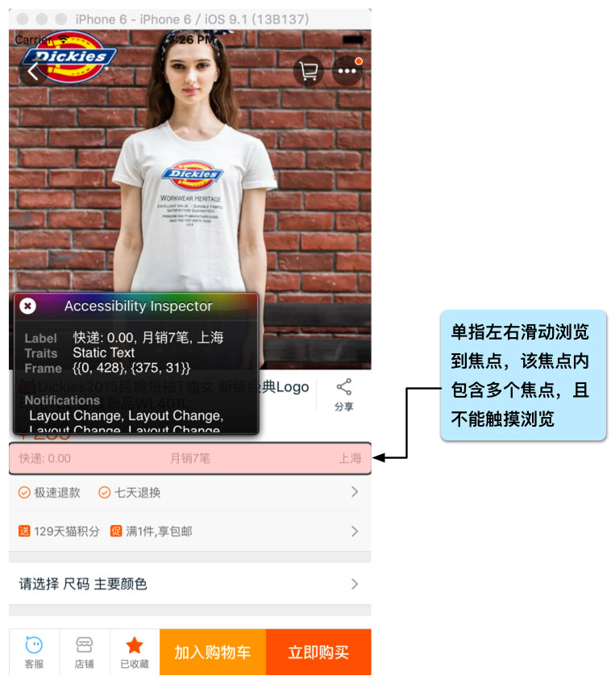

## 用户问题
### 1. 一个焦点覆盖到多个元素
#### 描述
一个焦点覆盖多个元素，当触摸或滑动到这个焦点的时候会把这个焦点覆盖的所有元素朗读出来，
触摸到这个界面的空白部分也朗读这个覆盖多个元素的焦点。
#### 现状
  

### 2. 焦点顺序不符合逻辑
#### 描述
在界面上滑动浏览时，对象获得焦点的顺序与实际显示的顺序不一致，例如界面上从左到右依次有一个编辑框、
一个确定按钮、一个取消按钮，当焦点在编辑框上时向右滑动一次取消按钮获得焦点就是不符合实际的逻辑顺序，
正确的焦点顺序应该是：当编辑框聚焦的时候向右滑动一次是确定按钮聚焦，再向右滑动一次取消按钮聚焦。
#### 现状
  
  
### 3. 部分控件无焦点
#### 描述
控件无法滑动和触摸浏览，或者控件只能触摸浏览。可能原因是没有给标准控件设置焦点，或者自定义的控件没有支持无障碍访问。
#### 现状
   
